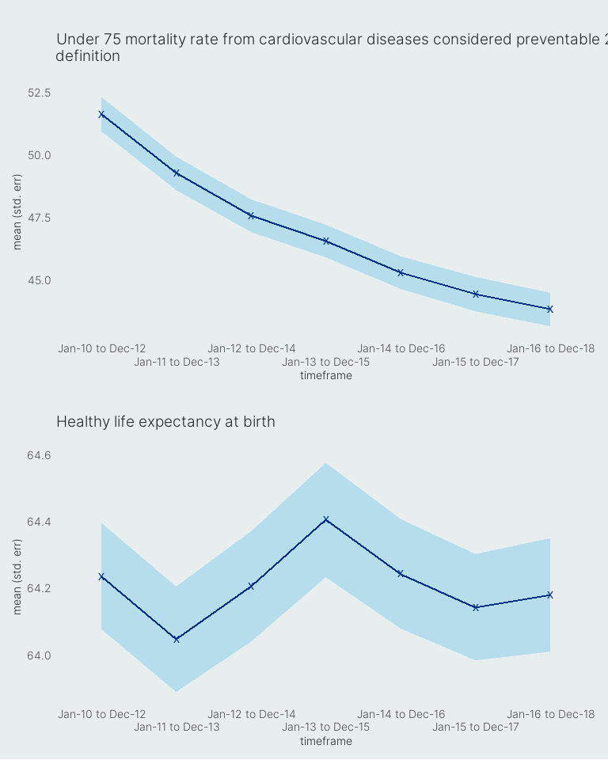
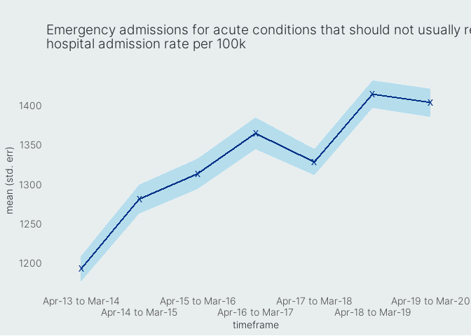
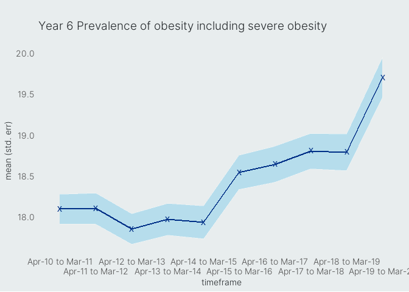
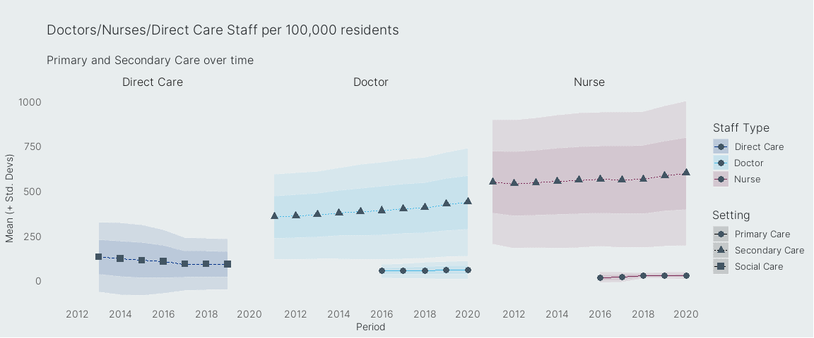

Introduction
============

<!--html_preserve-->
<h2>
Overview
</h2>

This document gives an overview of the <strong>Integrated Care System
Metrics</strong> (or <strong>System Metrics</strong> for short), a
collection of measures which help to give an insight into the proess of
integration within an Integrated Care System (hereafter referred to as
ICS). These metrics were developed by the <strong>System Insight and
Analysis (SIA)</strong> team within the <strong>System
Transformation</strong> directorate of NHS England and Nhs Improvement.
They are designed to give a <em>light overview</em> the challenges
facing the English health system and in particular ICSs, and open up
avenues of enquiry for further exploration. They are
<strong>not</strong> designed to be an <em>exhaustive</em> list of all
the things an ICS should be interested, nor as a tool for holding ICSs
to account. Rather, the hope is that they serve as an entry point for
ICSs to consider the challenges facing their health system and should
naturally lead ICSs into further work in areas such as <em>Population
Health Management (PHM)</em>. Crucially the System Metrics help to
illustrate challenges that will liekly only be fixed through
collaborative working between the multiple agencies and organisations
working within an ICS.

<!--/html_preserve-->

| Theme                                                                                   | Metric                                                                                   | Long-Term Plan priority area | Availiable Date | Geographical Availibilty | Frequency |
|:----------------------------------------------------------------------------------------|:-----------------------------------------------------------------------------------------|:-----------------------------|:----------------|:-------------------------|:----------|
| Are systems delivering better, more equal outcomes to the people who live there?        | Healthy Life expectancy                                                                  | Prevention & inequalities    | 2020/21         | PCN/neighbourhood        | Annual    |
| Are systems delivering better, more equal outcomes to the people who live there?        | Avoidable mortality under-75 due Cardiovascular disease                                  | Better Outcomes              | 2020/21         | Place                    | Annual    |
| Are systems delivering better, more equal outcomes to the people who live there?        | All cause age adjusted mortality rate                                                    | Better Outcomes              | 2021/22         | PCN/neighbourhood        | Annual    |
| Are systems delivering better, more equal outcomes to the people who live there?        | The Integration Index (new)                                                              | Better Quality & Workforce   | 2020/21 (Q3-4)  | TBD                      | TBD       |
| Are systems delivering better, more equal outcomes to the people who live there?        | Proportion of adults in contact with secondary mental health services in paid employment | Service Transformation       | 2020/21         | Place                    | Annual    |
| Are systems working together more effectively?                                          | System partnership effectiveness (new)                                                   | Leadership & relationships   | 2021/22         | ICS                      | Annual    |
| Are systems working together more effectively?                                          | Avoidable admissions                                                                     | Service Transformation       | 2020/21         | Place                    | Quarterly |
| Are systems working together more effectively?                                          | Digital transformation (TBD)                                                             | Service Transformation       | 2021/22         | ICS                      | Annual    |
| Prevention                                                                              | Percentage of physically active adults                                                   | Prevention & inequalities    | 2020/21         | Place                    | Annual    |
| Prevention                                                                              | Childhood obesity                                                                        | Prevention & inequalities    | 2020/21         | Place                    | Annual    |
| Are staff more supported and satisfied with their ability to provide high quality care? | Clinical, nursing and social care workforce per capita                                   | Better Quality & Workforce   | 2020/21         | Place                    | Quarterly |
| Financial efficiency                                                                    | Weighted per capita spend across primary care, secondary care and social care            | Finance                      | 2021/22         | ICS                      | Annual    |

Metrics
=======

Are systems delivering better, more equal outcomes to the people who live there?
--------------------------------------------------------------------------------

<!--html_preserve-->
<h4>
Metrics
</h4>
<ul>
<li>
Healthy Life expectancy 
</li>
<li>
Avoidable mortality under-75 due Cardiovascular disease 
</li>
<li>
All cause age adjusted mortality rate 
</li>
<li>
The Integration Index (new, to be trailed in 20/21) 
</li>
<li>
Proportion of adults in contact with secondary mental health services in
paid employment
</li>
</ul>
<h4>
Rationale
</h4>

These metrics are predominantly focussed on <em>long-term</em> outcomes
which will likely only be changed through <em>coordinated</em> work from
partners across an Integrated Care System. They represent some
<em>ultimate measures of success</em> for a system overall. They are
things which can be changed in absolute terms (i.e. are not zero-sum
such as ‘position relative to a group average’) over time and have the
propensity affect either all or significant groups of people within a
system. Changes in this domain will take time to show and as such
measurements are typically taken less often. Progress against these
metrics will represent improments in the functioning of an ICS overall
and will likely be preceeded by changes in other areas of the System
Metrics such as prevention or working together more effectively.

<!--/html_preserve-->

#### Visualation over time

<!--html_preserve-->
<h2>
Are systems working together more effectively?
</h2>
<h4>
Metrics
</h4>
<ul>
<li>
System partnership effectiveness (TBD)
</li>
<li>
Avoidable admissions
</li>
<li>
Digital transformation (TBD)
</li>
</ul>
<h4>
Rationale
</h4>

It is recognised that multi-agency working itself is crucial to the
success of the ICSs to achieve their goals. These metrics focus on
quantifying in some way how much of this change is happeninh within a
system and in which places. <code>System partnership
effectiveness</code> represents how well organisations are able to work
with one another and will be a new metric which is currently uder
development; it will focus on the relative ease or difficulty for
different organisations to work with one another within the system. This
will not be displayed as a single numeric value but rather a set of
connections representing the strengh of relationships between different
key parts of a system. <code>Digital Transformation</code>, also a new
metric will look at the ability for those working within an organisation
to access the information they need to do their job effectively. This
will be set up to detect the outcome of digital transformation work,
aiming to improve how data and information flows between different parts
of a system. Again this will not necessarily be a single number but
rather performance across a set of key <em>domains</em>. <code>Avoidable
admissions</code> differs slightly to the other two metrics in this
category and aims to capture unmet need, which often show as admissions
in secondary care settings which could have been avoided. Whilst this
almost certainly will not capture all <em>unmet need</em>, a reduction
in avoidable admissions would be a strong indication that community
health needs are being dealt with in the most appropriate settings
effectively.

<!--/html_preserve-->

#### Visualisation over time

<!--html_preserve-->
<h2>
Prevention
</h2>
<h4>
Metrics
</h4>
<ul>
<li>
Percentage of physically active adults
</li>
<li>
Childhood obesity
</li>
</ul>
<h4>
Rationale
</h4>

As \[life expectency in the UK continues to rise\]\[1\] more and more
individuals will live for longer in ill-health unless advances are also
seen in the amount and age to which population groups within England are
able to remain healthy over the course of their life. This is a huge
public health challenge and one which ICSs will focus on in years to
come. The two metrics included within this section are two broad
measures in two key areas which help to illustrate to what extent people
within a system are practicing <em>healthy behaviours</em>. The
<code>Percentage of physically active adults</code> help to give an
overview of how adults within different geographical areas are
maintiaining one such healthy behavious. Whilst other healthy behaviours
could be identified for this group (such as smoking cessation) this
measure captures something which <em>nearly all</em> if not <em>all</em>
members of a population could do to improve thier health which is linked
to other healthy behaviours such as the avoidance of excessive alcohol
consumption or smoking and healthy eating. Whilst work can be done with
adult groups to encourage such healthy behaviours, it's also recognised
that healthy behaviours begin in childhood and as such <code>Childhood
obesity</code> (in year 6) is also included which helps give a good
picture of health in childhood cohorts as they transition from primary
to secondary schools and from childhood to adolescence. Improvements in
childhood health education should lead to improvements in this metric
and over time carry through into the adult metric.

These metrics are included both to give an indication of how efforts in
public health may be progressing in ICSs but also to maintain a focus on
the benefits which can be realised long-term from coordination around
such issues.

\[1\]:
<a href="https://www.ons.gov.uk/peoplepopulationandcommunity/birthsdeathsandmarriages/lifeexpectancies/bulletins/nationallifetablesunitedkingdom/2017to2019#life-expectancy-at-birth-in-the-uk">https://www.ons.gov.uk/peoplepopulationandcommunity/birthsdeathsandmarriages/lifeexpectancies/bulletins/nationallifetablesunitedkingdom/2017to2019\#life-expectancy-at-birth-in-the-uk</a>
Office for National Statistics - National life tables – life expectancy
in the UK: 2017 to 2019

<!--/html_preserve-->

#### Visualisation over time

<!--html_preserve-->
<h2>
Are staff more supported and satisfied with their ability to provide
high quality care?
</h2>
<h4>
Metrics
</h4>
<ul>
<li>
Clinical, nursing and social care workforce per capita
</li>
<li>
Staff supported to do role effectively (TBA)
</li>
</ul>
<h4>
Rationale
</h4>

ICSs cannot achieve the goals they set out to without supported staff in
the parts of the system where they are most needed. In recent years
staffing levels have grown in some areas (such as Secondary Care) and
remained stagnant in others (such as those employed in direct care roles
with Adult Social Care). Whilst growth may largely reflect the amount of
activity flowing through those areas, it is not necessarily the case
that levels of staffing are most appropriate for the needs within a
community. The <code>clinical, nursing and social care workforce per
capita</code> is in fat a series of metrics which aim to show how
staffing levels across sectors have varied over time and beteen
different systems or parts of a System.

This metric comprises:

<ul>
<li>
<code>Secondary care doctors per capita</code>
</li>
<li>
<code>Secondary care nurses per capita</code>
</li>
<li>
<code>Primary care doctors (GPs) per capita</code>
</li>
<li>
<code>Primary care nurses per capita</code>
</li>
<li>
<code>Social care staff in direct care roles per capita</code>
</li>
</ul>

It may be preferable in the future to also include a metric of
<code>Staff supported to do their role effectively</code> giving an
overview of how staff in different parts of ICS feel they are supported
to do their job effectively. This may come as part of continuation to
the <strong>National Integration Index</strong> work, or as a
self-report measure delivered through existing staff surveys across a
system.

<!--/html_preserve-->

#### Visualisation over time

<!--html_preserve-->
<h2>
Financial efficiency
</h2>
<h4>
Metrics
</h4>
<ul>
<li>
Weighted per capita spend across primary care, secondary care and social
care
</li>
</ul>
<h4>
Rationale
</h4>

One of the major changes highlighted in the \[NHS Long-Term plan\]\[1\]
was the need to share budgets between organisations working together so
resources could be more effectively funnelled to where they are most
needed and to pen up greater opportunities for cross-organisation
working. As part of this it, is recognised that the wy in which money is
distributed between different parts of a ICS is crucial to understanding
why certain parts of a system may be struggling. <code>weighted per
capita spend across primary care, secondary care and social care</code>
is designed to give a high level overview is being spent by a system and
how this both <em>has</em> and <em>continues to</em> change over time.

This metric comprises:

<ul>
<li>
Secondary care spend per capita (£)
</li>
<li>
Primary care spend per capita (£)
</li>
<li>
Social Care spend per capita (£)
</li>
</ul>

\[1\]
<a href="https://www.longtermplan.nhs.uk/">https://www.longtermplan.nhs.uk/</a>
NHS Long-Term Plan

<!--/html_preserve-->

Principles
==========

<!--html_preserve-->
<h3>
Open Source
</h3>

The Systems Metrics have been designed using <em>open-source</em>
principles with the aim of ensuring all data, code and documentation is
accessible and made usable by the communities it is designed to serve.
For this reason all guidelines are written in
<code>markdown</code>/<code>RMarkdown</code> allowing for guides to be
readily and flexibly adapted for different audiences and into a variety
of formats including:

<ul>
<li>
Websites
</li>
<li>
HTML documents / Word Documents
</li>
<li>
Presentations (e.g. ioslides, reveal.js, PowerPoint)
</li>
<li>
Jupyter/RMarkdown notebooks
</li>
</ul>

The full code used to generate this workbook including all data used is
availible on
<a href="https://www.github.com/ewan-wakeman/SystemMetrics">GitHub</a>
and can be used as the starting point for any future analyses. If you
have Git installe don your machine you can create a copy of this project
by running the following command in terminal

<pre><code class="bash">git clone https://www.github.com/ewan-wakeman/SystemMetrics
</code></pre>

In addition to this, all data used in the System Metrics is publicly
accessible, and the source code needed to <strong>access, compile, clean
and present</strong> this data is availible to anyone free of charge to
<strong>use, modify and distribute</strong> as required. For those
working in ICSs (both NHS and Non-NHS organisations), data is also made
avaliable through the NHS Viewpoint platform (\[part of the NHS Insights
Platform\]\[1\]) both in the form of interactive dashboards
and an access point for downloding cleaned source level data for use in
other analytical work.

The System Metrics will always seek to provide data in machine-readable
formats (e.g. <code>.csv</code>, <code>.json</code>), accesible wherever
possible through APIs, and published alongside the code needed to
replicate any analysis.

\[1\]
<a href="https://www.england.nhs.uk/insights-platform/">https://www.england.nhs.uk/insights-platform/</a>
NHS Insights Platform

<!--/html_preserve-->
<!--html_preserve-->
<h3>
Show your workings
</h3>

For the benefit of analytical teams the code used to produce this
document is included trhoughout this document. This code can be edited
and rerun using <a href="https://rstudio.com/">RStudio</a> which is
freely availible for use.

<pre><code class="r"># A dummy code block
txt &lt;- c(&quot;show&quot;, &quot;your&quot;, &quot;workings!&quot;)
print(paste(txt))
</code></pre>
<!--/html_preserve-->

Important Concepts
==================

Time Series and Trends
----------------------

<!--html_preserve-->

One of the factors in deciding whic metrics to include in the system
metrics was whether there was historical data on how this metric had
changed over time, prior to the inception of ICSs. Trends over time can
tell us far more about what has happened in healthcare and the strengths
/ challenges facing healthcare across England. As it is recognised that
no two parts of the country are the same, changes within an area over
time are often a far more useful measure of meaningful change than
comparing an area to a national or regional benchmark, where differences
could be simply to do with differences in the areas which make up an ICS
or the populations they serve. It also gives us an indication of what
<strong>significant change</strong> would look like by showing how much
change is observed naturally from year to year. Time series helps to
situate and anchor abstract data and understand more intuitively what
changes are worth paying a lot of attention to.

Whilst some of the System Metrics re new and therefore dont yet have any
historical data, regular data capture points will be gathered for each
of them and used to construct a picture of how things change over time.
This change is what ICSs are looking to make, and is a more useful thing
to fous on than comparison to a national average or median.

<!--/html_preserve-->

Geographical Variation
----------------------

<!--html_preserve-->

Another focus of the System Metrics, is to use metrics which are
availiable at a <em>place</em> or <em>neighbourhood</em> level rather
than only ICS level in the majority of cases. The reason for this is a
recognition that ICSs are not homogenous and in fact, there is likely
greater variation between different places within a single ICS than
there are between the averages of any two ICSs in the country. The
differences within an ICS also give us an indication of how varied the
outcomes in different metrics are across a System and when compared
alongside \[Time-series\]\[\#time-series\] data can give a greater
indication of how and where changes are happening. A slight change in a
metric at a system level could be because all places within the STP have
changed slightly or that a few places have changed significantly.
Understaning <em>variation</em> and where change is taking place within
a system helps to give a much fuller understanding of what is happening
and means data can be more readily corroborated with local intelligence
about what is happening within parts of a system.

It should be noted that - at present - no formal, unambiguous definition
of place exists which allows for ICSs to be divided up and changes to be
observed. As such, the System Metrics currently use <code>Local
Authority Districts</code> as a proxy for place, as these most closely
match the definitions of place set out in the Long-Term Plan. This means
that the overwhelming majority of ICSs have multiple places within them,
for which data exists. These definitions are widely used in public
health and local government. Where necessary NHS data published at CCG
level has been transformed to match the Local Authority District
footprint based on population-weighted means where boundaries between
CCG and place overlap.

Simlarly, whilst Primary Care Networks are considered to be
representative of <em>Neighbourhoods</em> within a system, these
definitions are based on General Practice (GP) patient lists which are
naturally not publicly availible or used in any public metrics outside
of those directly relating to Primary Care. As such the System Metrics
use the Office for National Statistics' Statistical Geography
<code>Mid-Layer Super Output Area (MSOA)</code> to represent
Neighbourhoods. These have defined geogrpahical boundaries, closely
mirror the definitions of Neighbourhood set out in the Long-Term Plan,
and have boundaries which are co-terminus with both <code>Local
Authority Districts</code> and <code>Integrated Care System</code>
boundaries.

<!--/html_preserve-->

Relationships between metrics
-----------------------------

<!--html_preserve-->

The System Metrics are intended to give a view across different parts of
a system, for measures that relate to both activity and outoomes in the
short, medium and longer term. As ICSs have come into being because
healthcare is spread over multiple areas and multiple related
organisations and agencies it follows that metrics realting to a system
will al be interrelated as well. Understanding the relationships between
different metrics both in the SYstem Metrics and beyond is therefore
crucial to uderstanding the System. Wherever possible

<!--/html_preserve-->

Demographic data
----------------

<!--html_preserve-->
<h3>
Indices of Multiple Deprivation
</h3>
<h3>
Ethnicity Data
</h3>
<!--/html_preserve-->

Visualisation of Data
=====================

Links to other work
===================
